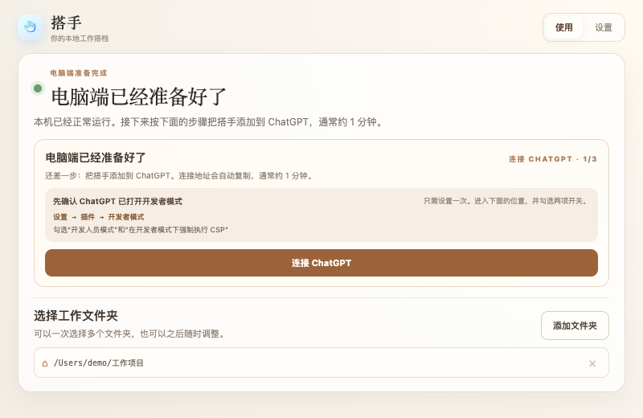
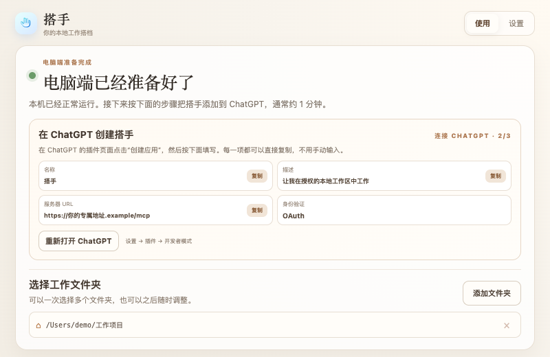

# 搭手 Dashou

## 让 ChatGPT 进入你授权的本地工作区，把事情做完

搭手是一款桌面工具。你选择工作文件夹后，可以在 ChatGPT 里让它读取文件、修改内容；需要运行命令或执行测试时，由你在设置中主动开启，少一些来回复制粘贴。


## 第一次使用，只做四件事

1. **安装搭手**：首批 Mac 安装包由测试联系人通过微信发送；Windows 用户使用联系人提供的安装包。只打开你确认来源的文件。
2. **准备电脑端**：打开搭手，点击 **开始使用搭手**；准备完成后，选择一个或多个工作文件夹。
3. **连接 ChatGPT**：点击 **连接 ChatGPT**，跟着客户端里的 **1/3 → 2/3 → 3/3** 操作。名称、描述、连接地址和授权密码都能直接复制，不用手动输入。
4. **完成只读检查**：连接成功后，点击 **复制任务并打开 ChatGPT**。搭手会准备好这句话：

```text
请列出我选择的项目，并告诉我每个项目是做什么的。先不要修改文件。
```



当客户端明确显示 **ChatGPT 已连接**，并且上面的只读任务能够列出项目，才算第一次连接真正完成。

## 不用记住连接参数

搭手会在当前步骤告诉你下一步做什么：

- 第 1 步：打开 ChatGPT 开发者模式；
- 第 2 步：复制名称、描述和服务器 URL；
- 第 3 步：复制授权密码并完成确认；
- 连接后：复制第一个只读任务，确认工作区可用。



完整截图和逐步说明见：[连接 ChatGPT 图文手册](docs/chatgpt-connect.md)。

## 第一次使用最重要的四件事

- **只选择愿意授权的文件夹**，不要直接选择整个个人目录或包含密码、证件的目录。
- **项目命令默认关闭**。确实需要运行测试或构建时，再到搭手设置中主动开启并看清任务内容。文件读取和修改限制在你选择的文件夹中；项目命令会使用当前电脑账户的权限，搭手不是完整的系统沙箱。
- **连接地址和授权密码只在自己的 ChatGPT 连接页面使用**，不要发到群聊、Issue 或公开网页。
- **关闭窗口不会退出搭手**。真正停止时，请从 Mac 菜单栏或 Windows 系统托盘选择 **退出搭手**。

## 卡住时怎么求助

打开搭手 **设置 → 搭手排查卡 → 复制排查信息**，把下面三项发给测试联系人：

1. 当前页面截图；
2. 复制的排查信息；
3. 你卡在哪一步。

排查信息不包含授权密码、连接凭据、文件夹路径、文件内容或 ChatGPT 对话。常见问题见 [故障排查](docs/troubleshooting.md)。

## 使用手册

- [Mac 安装与首次打开](docs/mac-install.md)
- [Windows 安装与升级](docs/windows-install.md)
- [连接 ChatGPT 图文手册](docs/chatgpt-connect.md)
- [故障排查](docs/troubleshooting.md)
- [给自动化助手读取的安装清单](docs/install-manifest.json)

连接完成后，你可以在 ChatGPT 网页版、电脑端或手机端继续对话；实际工作仍发生在安装并运行搭手的这台电脑上。

当前仍是小范围体验。版本更新、已知问题和安装包记录以 [GitHub Releases](https://github.com/winston003/dashou-releases/releases/) 为准。
