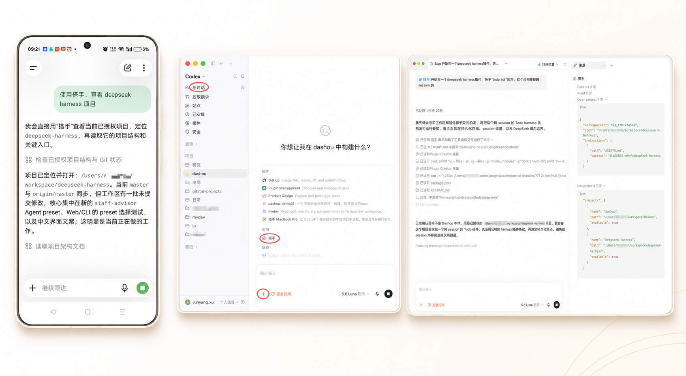
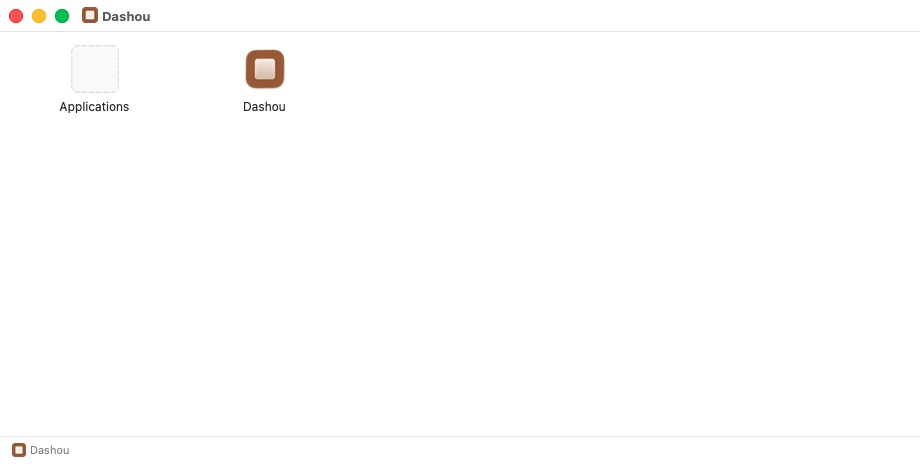
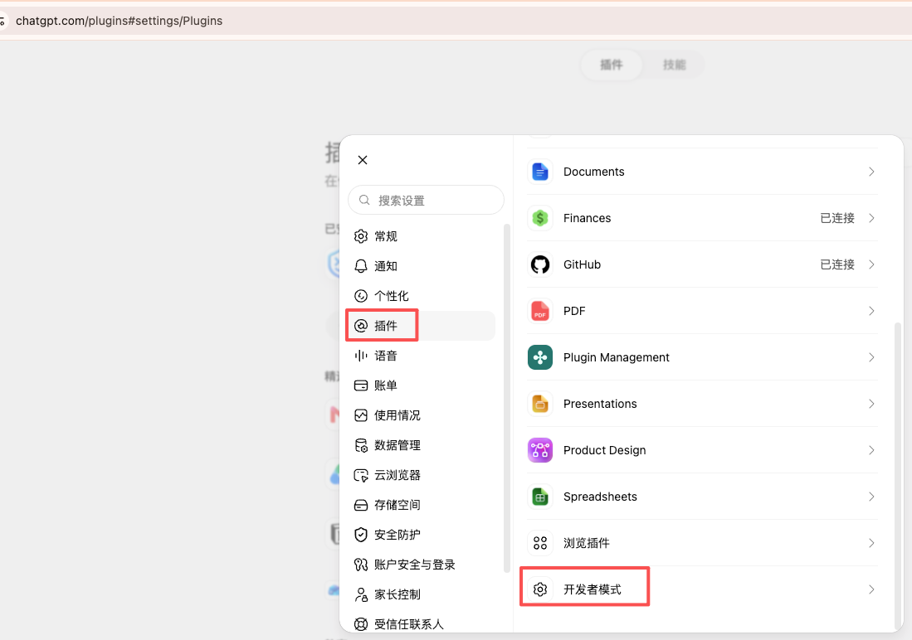
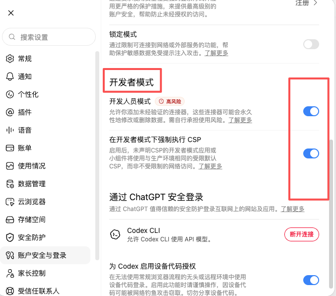
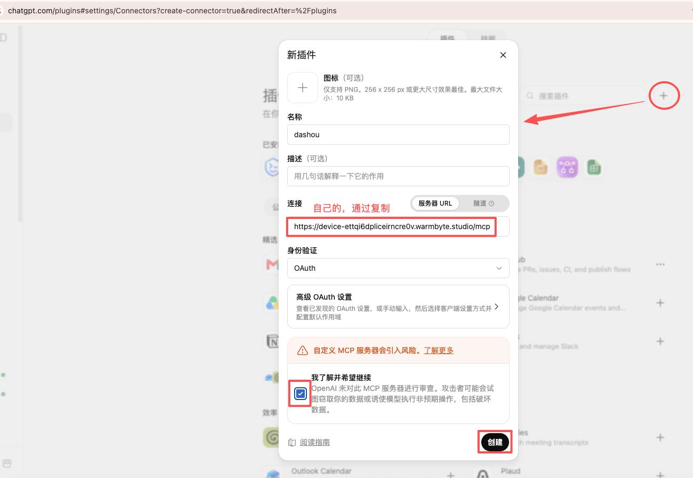
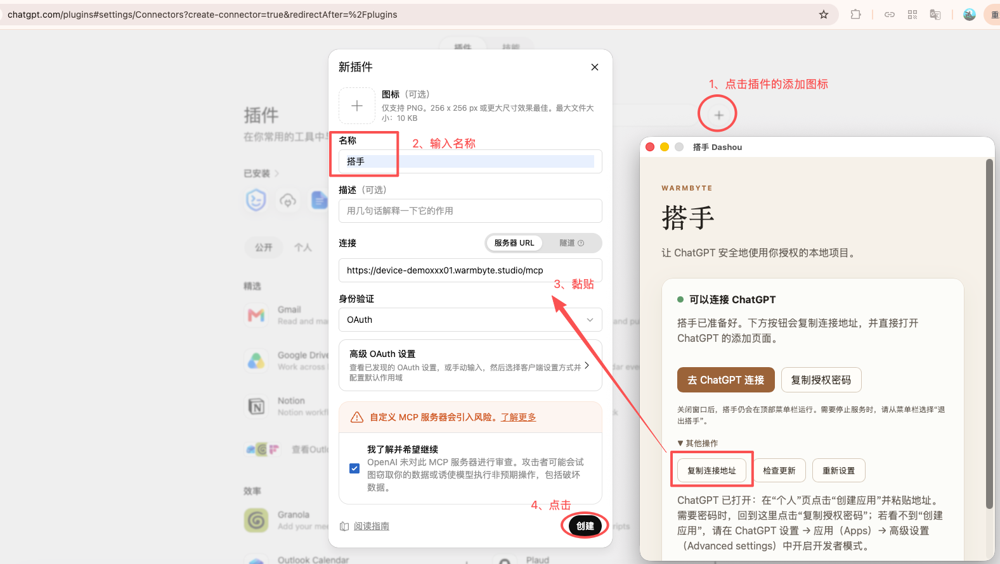
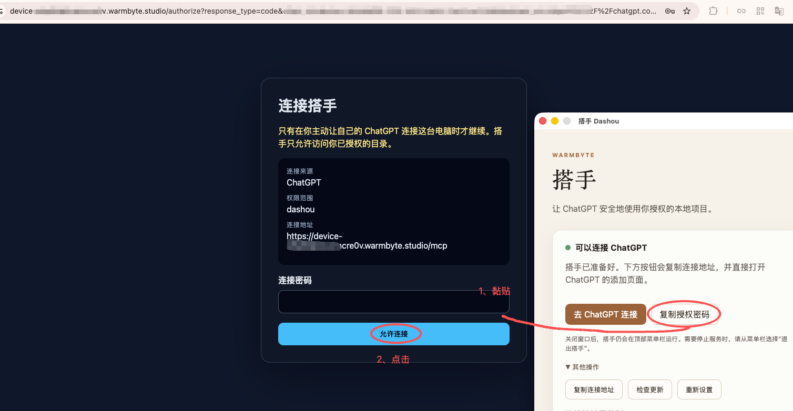
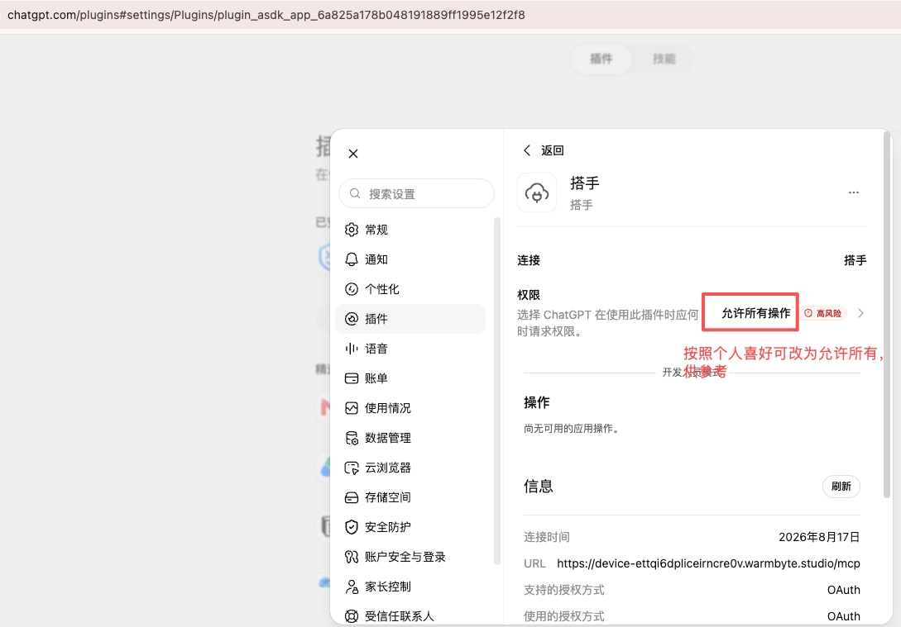
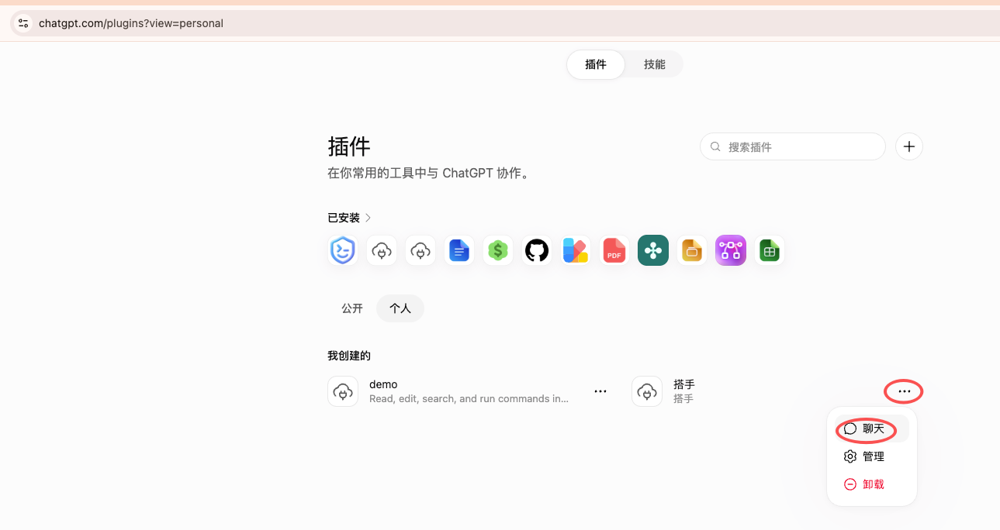
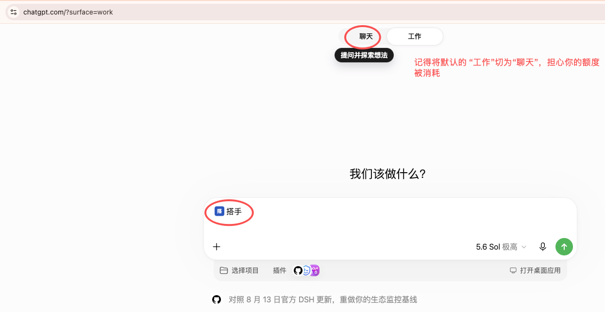

# 搭手 Dashou

## 让 ChatGPT 直接帮你处理本地项目

搭手是一款可以连接你本地电脑的智能体工具。授权后，ChatGPT 可以在你选择的工作文件夹里读取项目、修改代码、运行命令和执行测试。

你不需要在 ChatGPT 和电脑之间反复复制粘贴，也不必手动整理上下文。只要用自然语言说清楚想做什么，搭手就会在本地帮你完成，并把结果带回聊天中。

目前是小范围体验。你选择哪些文件夹，就决定 ChatGPT 可以使用哪些项目；请只选择你愿意授权的工作文件夹。


**体验地址：** [下载最新版本](https://github.com/winston003/dashou-releases/releases/latest)

如有问题，请联系我微信。感谢你的体验和反馈。

## 一个搭手，三种使用方式

搭手准备好以后，使用同一个 ChatGPT 账号，你可以从不同入口继续处理自己的项目：

- **手机 ChatGPT**：随时查看项目、阅读文件和继续对话；
- **电脑端 ChatGPT / Codex**：适合持续修改、检查和运行项目任务；
- **网页 ChatGPT**：适合完整查看工作过程和任务结果。

无论从哪里开始，搭手连接的都是你亲自选择的本地文件夹。进入聊天后选中 **搭手**，再用自然语言告诉它你想做什么。



三张单独的示例图也保留在仓库中：

- [手机 ChatGPT](images/promo-mobile.jpg)
- [电脑端 ChatGPT / Codex](images/promo-desktop.png)
- [网页 ChatGPT](images/promo-web.png)

## 下载

请从 [最新版本页面](https://github.com/winston003/dashou-releases/releases/latest) 下载。

根据你的电脑选择：

- **Mac Apple Silicon**：M1、M2、M3、M4；
- **Mac Intel**：Intel 处理器的 Mac；
- **Windows**：Windows 安装包。

请不要从其他网站下载，也不要把自己的连接地址或连接密码发给别人。

## macOS 安装

当前免费体验包还没有 Apple 官方签名和公证。第一次打开时，macOS 可能会提示“无法验证开发者”。这不是搭手服务故障。

1. 双击下载的 `.dmg` 文件；
2. 把 **Dashou** 拖到 **Applications（应用程序）**；
3. 打开“应用程序”文件夹；
4. 对 Dashou 点右键，选择 **打开**；
5. macOS 再询问一次时，点击 **打开**。



只需要这样确认一次。之后通常可以直接打开搭手。

如果仍然打不开，请把提示窗口截图发给客服。不要关闭 Mac 的整体安全检查，也不需要打开终端输入命令。

## Windows 安装

双击 Windows 安装包，按安装向导完成安装，然后打开 **搭手 Dashou**。Windows 版本不需要安装额外的运行环境。

## 第一步：在搭手里准备这台电脑

打开搭手后，按顺序操作：

1. 点击 **加入试用**；
2. 等待页面显示准备进度；
3. 准备完成后，点击 **添加文件夹**；
4. 选择一个或多个工作文件夹；
5. 点击 **开始使用**。

搭手会自动完成连接准备，你不需要填写地址或其他技术信息。

完成后点击 **去 ChatGPT 连接**。搭手会自动复制这台电脑的连接地址，并打开 ChatGPT 页面。

> 截图里的 `device-...warmbyte.studio/mcp` 只是示例。每台电脑的地址都不同，请使用搭手自动复制的地址。

## 第二步：打开 ChatGPT 的开发者模式

如果你已经能看到“创建应用”，可以直接跳到下一节。

如果看不到：

1. 打开 ChatGPT；
2. 进入 **设置**；
3. 点击 **插件**；
4. 打开 **开发者模式**。



在开发者模式页面打开需要的开关，然后返回 ChatGPT 的个人插件页面：



直接入口：[ChatGPT 插件设置](https://chatgpt.com/plugins?view=personal)

如果你使用的是工作区账号，可能需要工作区管理员在工作区设置中允许创建应用。

## 第三步：把搭手添加到 ChatGPT

在 ChatGPT 的插件页面：

1. 选择 **个人**；
2. 点击右上角的 **+**；
3. 打开“新插件”窗口。



按页面填写：

- **名称**：搭手；
- **描述**：让我在授权的本地项目中工作；
- **连接方式**：服务器 URL；
- **服务器 URL**：粘贴搭手自动复制的地址；
- **身份验证**：OAuth；
- 勾选“我了解并希望继续”；
- 点击 **创建**。



不要手动修改地址，也不要照抄截图中的示例地址。

## 第四步：完成连接

创建后，ChatGPT 会打开搭手连接页面。点击：

**使用搭手登录**


随后会打开搭手授权页面。

回到搭手窗口，点击 **复制授权密码**；再回到浏览器，把密码粘贴到“连接密码”输入框，然后点击 **允许连接**。



这是这台电脑的连接密码，只在你自己的 ChatGPT 页面使用。不要把它发到聊天、Issue 或公开页面。

## 第五步：确认权限

连接完成后，在 ChatGPT 中打开：

**设置 → 插件 → 搭手**

根据你想做的事情选择权限：

- 只想查看项目：先保留较少权限；
- 想让 ChatGPT 新增或修改文件：开启对应的写入权限；
- 想让 ChatGPT 运行项目命令：请先确认命令内容和运行结果。



每次让 ChatGPT 修改文件或运行命令前，都建议先看清楚它准备做什么。

## 第六步：在聊天中使用搭手

回到 ChatGPT 的插件页面，确认“搭手”已经出现在“我创建的”列表中：



然后进入 **聊天**，打开消息输入框下方的插件入口，选择 **搭手**：



确认输入框附近出现搭手图标后，就可以开始说你的任务：


第一次使用建议先做一个只读任务：

```text
请列出我已经选择的项目，并告诉我每个项目所在的文件夹名称。先不要修改任何文件。
```

确认连接正常后，再进行具体工作，例如：

```text
请检查这个项目的 README，告诉我最适合先改进的地方，先不要修改文件。
```

## 你可以让搭手做什么

你可以直接用自然语言提出任务，例如：

```text
请阅读这个项目，告诉我它是做什么的，以及从哪里开始运行。
```

```text
请修复登录页面的这个问题，修改前先告诉我你的计划，完成后运行测试。
```

```text
请运行项目测试。如果失败，告诉我失败原因，先不要修改文件。
```

建议先从“阅读、说明、检查”开始，熟悉后再让搭手修改文件或运行命令。

## 多个文件夹和隐私

- 你可以一次选择多个工作文件夹；
- 只有你选择的文件夹会作为项目提供给 ChatGPT；
- 你可以随时添加或移除文件夹；
- 搭手不会要求你把本地文件发送给客服；
- 不要把连接地址或连接密码发到公开地方；
- ChatGPT 可能会在修改文件或运行命令前请求确认，请认真查看确认内容。

你始终可以做主：不确定时，先让 ChatGPT“只读检查，不要修改”。

## 关闭和重新打开搭手

关闭窗口不会停止搭手。它会收起到 macOS 顶部菜单栏，连接会继续运行。

- 想重新打开：点击顶部菜单栏的搭手图标；
- 想真正停止：点击搭手图标，选择 **退出搭手**。

Windows 用户关闭窗口后，也可以从开始菜单重新打开搭手。

## 常见问题

### macOS 提示“无法验证 Dashou”

这是免费体验包的正常提示。请在“应用程序”中对 Dashou 点右键，选择“打开”，再点击一次“打开”。不要关闭 Mac 的整体安全检查。

### 找不到“创建应用”

先打开 ChatGPT **设置 → 插件 → 开发者模式**。如果仍然没有，可能是账号类型或工作区设置暂未开放自定义连接，请联系工作区管理员。

### 点击“加入试用”后没有变化

先等待页面显示结果，再重新打开搭手查看状态。如果仍然没有反应，点击页面上的 **复制排查信息**，把这段排查信息发给客服。不要发送连接密码、完整日志或账户文件。

### ChatGPT 看不到我的项目

回到搭手确认：

1. 试用已经准备完成；
2. 已经选择了正确的一个或多个文件夹；
3. ChatGPT 中已经选中了搭手；
4. 连接仍然显示为已连接。

可以先发送：

```text
请列出我已经选择的项目。
```

### 连接密码不正确

回到搭手重新点击 **复制授权密码**，不要使用旧截图或旧密码。然后回到当前连接页面重新粘贴。

### 我想更换本地目录

在搭手中打开文件夹设置，添加或移除文件夹，再回到 ChatGPT 发送：

```text
请重新列出我已经选择的项目。
```

没有选择的文件夹不会作为项目提供给搭手。

## 更新

搭手会在客户端中检查新版本。安装包和更新文件只从本仓库的 [最新版本页面](https://github.com/winston003/dashou-releases/releases/latest) 获取。

每个版本的发布说明会写明最近改了什么、适用的平台和已知限制。更新时不要删除搭手的设置和连接状态，除非客服明确要求这样做。

## 给朋友或客服的一句话

请先打开搭手的[最新版本页面](https://github.com/winston003/dashou-releases/releases/latest)，下载适合你电脑的安装包。安装后点击“加入试用”，选择一个或多个工作文件夹，再点击“去 ChatGPT 连接”。连接完成后，在 ChatGPT 的聊天中选择“搭手”，直接说出你想做的事情即可。

## 版本说明

本仓库只放公开发布包和面向用户的使用说明。发布页面会持续补充每个版本的更新内容和已知问题。
