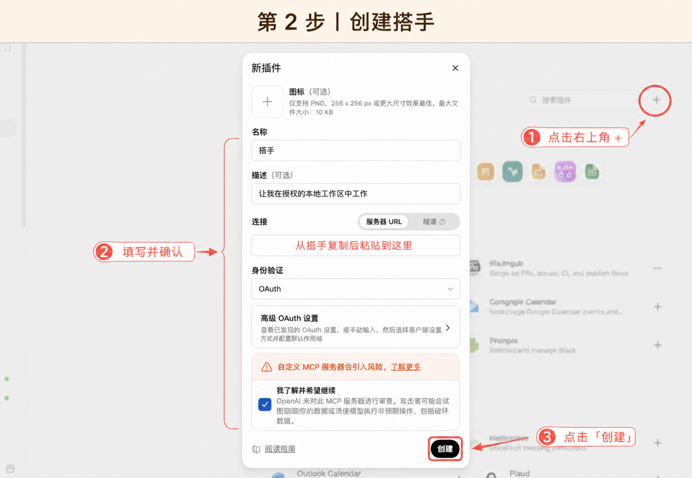
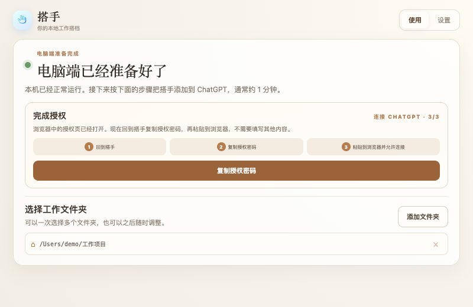
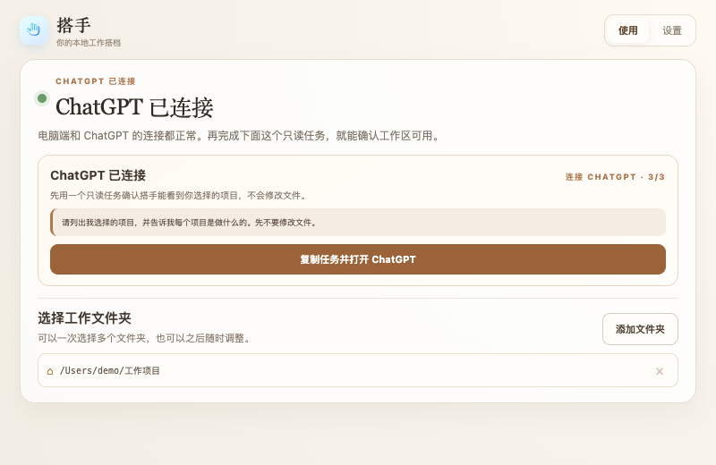

# 连接 ChatGPT：跟着搭手做 3 步

开始前，搭手应显示 **电脑端已经准备好了**，并且至少有一个工作文件夹。

> 不要照抄本文截图里的地址。每台电脑的连接地址不同，客户端会自动准备并提供复制按钮。

## 第 1 步：打开开发者模式

在搭手中点击 **连接 ChatGPT**。搭手会自动复制这台电脑的连接地址，并打开 ChatGPT 插件页。

如果 ChatGPT 没有显示创建入口，打开：

**设置 → 插件 → 开发者模式**


把下面两项都打开：

- **开发人员模式**；
- **在开发者模式下强制执行 CSP**。


这项设置通常只需完成一次。随后回到 ChatGPT 插件页。

## 第 2 步：创建搭手

搭手客户端会进入 **连接 ChatGPT · 2/3**，把要填写的内容放在同一页：


在 ChatGPT 插件页点击右上角 **+** 或 **创建应用**，然后填写：

| 项目 | 填写内容 |
| --- | --- |
| 名称 | `搭手` |
| 描述 | `让我在授权的本地工作区中工作` |
| 连接方式 | `服务器 URL` |
| 服务器 URL | 点击搭手里的 **复制**，再粘贴 |
| 身份验证 | `OAuth` |



确认页面上的风险说明后，点击 **创建**。如果 ChatGPT 随后显示“使用搭手登录”，继续点击它进入授权页。

## 第 3 步：完成授权

浏览器进入搭手授权页后，页面会直接告诉你从哪里复制密码：

1. 回到搭手客户端；
2. 点击 **复制授权密码**；
3. 回到浏览器粘贴；
4. 点击 **允许连接**。

搭手客户端也会同步变成 **连接 ChatGPT · 3/3**：



授权完成后不用继续点按钮。客户端会自动识别：

```text
授权已经完成
→ ChatGPT 正在确认连接
→ ChatGPT 已连接
```

不要把授权密码发给其他人，也不要使用截图里保存过的旧密码。

## 最后：完成第一个只读任务

当客户端明确显示 **ChatGPT 已连接**，点击 **复制任务并打开 ChatGPT**：



发送：

```text
请列出我选择的项目，并告诉我每个项目是做什么的。先不要修改文件。
```

ChatGPT 能列出你选择的项目后，客户端会记录第一次工具成功；这时才表示“搭手已经可以干活了”。之后再开始真实任务。

## 页面和本文不完全一样怎么办

ChatGPT 的按钮名称或位置可能随账号和工作区设置变化，但要完成的事情不变：

1. 打开开发者模式；
2. 创建应用并使用搭手提供的服务器 URL；
3. 选择 OAuth；
4. 在搭手授权页粘贴客户端提供的授权密码。

如果你的账号完全没有开发者模式或创建入口，先确认是否受工作区管理员限制。仍然找不到时，把 ChatGPT 当前页面截图和搭手排查信息发给测试联系人，不要反复删除或重装搭手。
