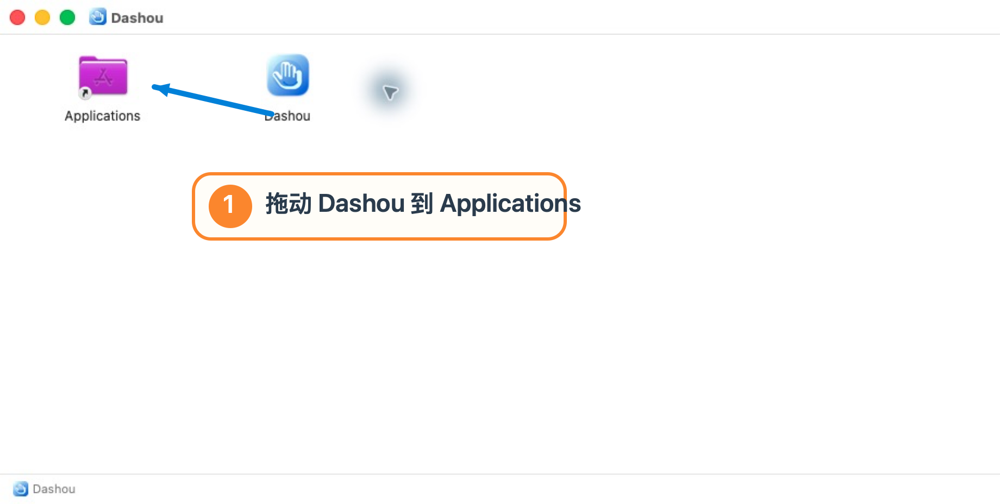
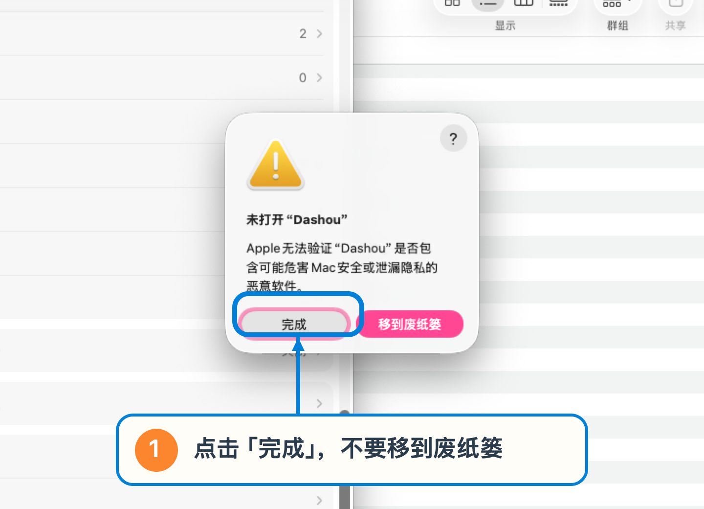
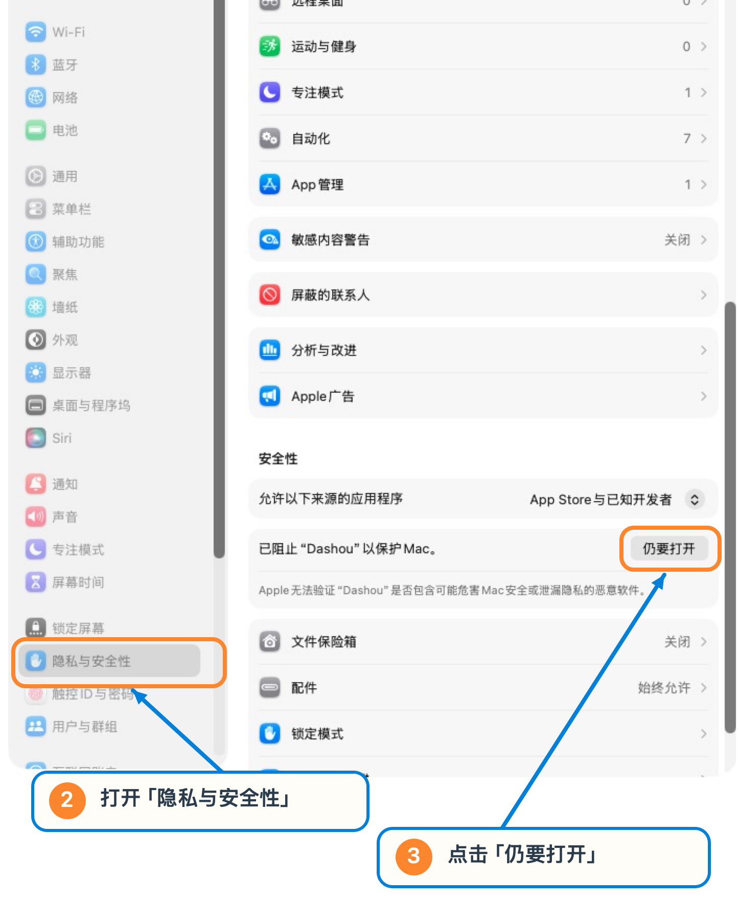
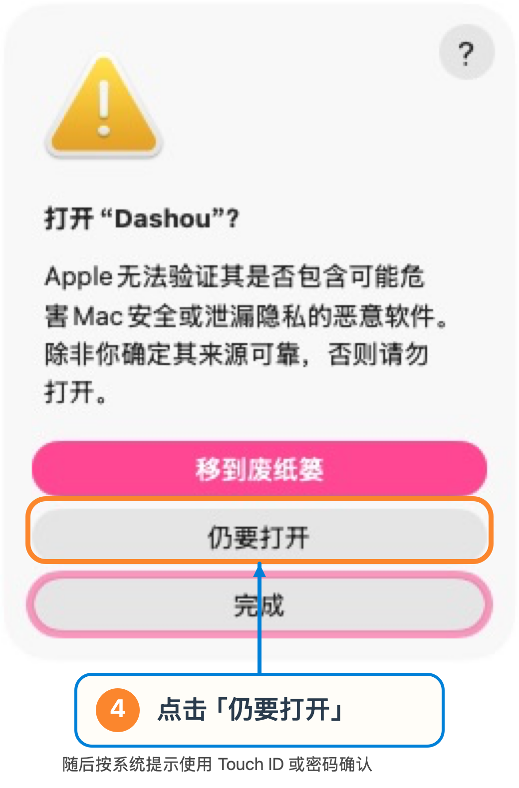
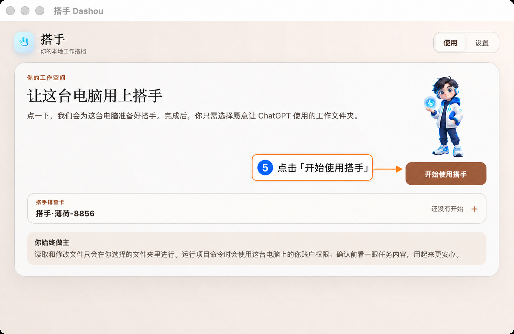

# Mac 安装与首次打开

首批 Mac 安装包由测试联系人通过微信发送。文件名通常包含版本号和芯片类型；不确定该用哪个时，把 **苹果菜单 → 关于本机** 的芯片信息截图发给联系人。

## 1. 放入“应用程序”

双击收到的 `.dmg`，把 **Dashou** 拖到 **Applications**。复制完成后关闭安装窗口。

## 2. 第一次打开时点击“完成”

在 Finder 的 **应用程序** 中双击 **Dashou**。如果出现“Apple 无法验证”或“未打开 Dashou”：

- 点击 **完成**；
- 不要点击 **移到废纸篓**。

## 3. 在“隐私与安全性”中允许打开

打开 **系统设置 → 隐私与安全性**，向下找到“已阻止 Dashou 以保护 Mac”，点击 **仍要打开**。

系统会再确认一次。点击 **仍要打开**，随后按系统提示使用 Touch ID 或管理员密码确认。

这项确认通常只需一次。不要关闭 Mac 的整体安全检查，也不需要打开终端输入命令。

## 4. 开始使用搭手

看到欢迎页面后，点击 **开始使用搭手**。

接下来等待准备完成，选择工作文件夹，再按 [连接 ChatGPT](chatgpt-connect.md) 继续。

## 为什么 Mac 会这样提醒

当前小范围体验包暂未使用 Apple 付费开发者签名和公证，因此 macOS 会要求你手动确认来源。这是安装确认，不代表搭手连接失败。

如果“隐私与安全性”里没有 **仍要打开**，回到 **应用程序** 再双击一次 Dashou，让系统先产生拦截记录，然后重新查看。
